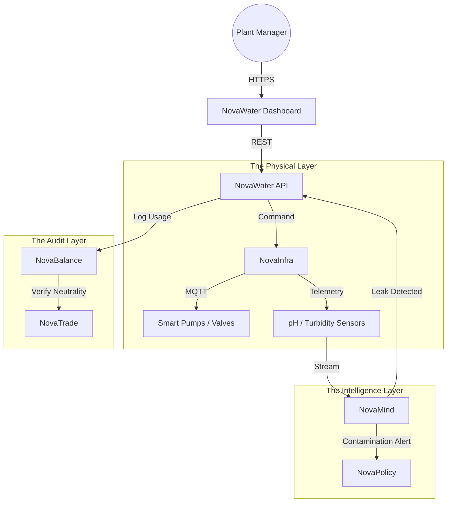

# 💧 NovaWater

> **The Operating System for the Blue Economy.**
> Digital management of industrial water cycles, desalination, treatment, and ecosystem restoration.

[](https://www.google.com/search?q=https://github.com/novaeco-tech/novawater/actions)
[](https://opensource.org/licenses/MIT)
[](https://www.google.com/search?q=https://water.novaeco.tech)

**NovaWater** is the Vertical Sector responsible for the world's most precious resource. While `NovaEnergy` manages the grid, **NovaWater** manages the pipe. It digitizes the flow of water through cities, factories, and farms to minimize waste, detect pollution events instantly, and certify "Water Neutrality."

It connects physical infrastructure (pumps, valves, sensors) with regulatory compliance and market mechanisms.

-----

## 🎯 Value Proposition

Water stress is a critical global risk. **NovaWater** transforms water management from a passive utility into an active, data-driven asset:

1.  **Industrial Circularity:** enabling factories (e.g., Breweries, Dye Houses) to treat and reuse gray water, reducing freshwater withdrawals by up to 80%.
2.  **Pollution Watchdog:** continuous monitoring of effluent discharge to ensure compliance with the **EU Water Framework Directive**.
3.  **Resilience:** integrating with weather data to predict droughts and automate rationing or rerouting logic before a crisis hits.

-----

## 🏗️ Architecture (The Digital Watershed)

NovaWater acts as the domain controller. It consumes telemetry from `NovaInfra` and uses `NovaMind` to predict flow dynamics.



### Integrated Services

  * **[NovaInfra](https://www.google.com/search?q=https://infrastructure.novaeco.tech):** The hardware interface. Manages the IoT sensors (Flow meters, dissolved oxygen sensors) and actuators (Sluice gates).
  * **[NovaMind](https://www.google.com/search?q=https://mind.novaeco.tech):** The hydro-intelligence. Uses ML models to detect "invisible" leaks based on pressure drops or predict contamination plumes.
  * **[NovaBalance](https://www.google.com/search?q=https://balance.novaeco.tech):** The accountant. Audits every liter used vs. returned to nature to calculate the "Water Footprint."
  * **[NovaPolicy](https://www.google.com/search?q=https://compliance.novaeco.tech):** The regulator. Automatically flags discharges that exceed legal chemical limits.

-----

## ✨ Key Features

### 1\. The "Closed-Loop" Controller

For industrial users (e.g., Textile Mills using `NovaTextile`), NovaWater orchestrates the internal treatment loop.

  * **Input:** Waste water with high dye content.
  * **Process:** Monitors filtration efficacy in real-time.
  * **Output:** "Grade A" Gray water ready for reuse in cooling towers.

### 2\. "Water Neutral" Certification

Just like Carbon Credits, NovaWater validates **Water Credits**.

  * If a company restores a wetland (`NovaNature`) that replenishes the aquifer, NovaWater measures the volume.
  * It sends a "Verified Outcome" to `NovaTrade`, allowing the company to sell these credits to offset their consumption elsewhere.

### 3\. Early Warning System (EWS)

It combines sensor data with external weather APIs.

  * **Scenario:** "Heavy Rainfall predicted + Sewer Levels High."
  * **Action:** Automatically commands `NovaInfra` to open storm surge valves to prevent urban flooding.

### 4\. Quality Compliance (e-Reporting)

Eliminates manual lab sampling for regulatory reporting.

  * Generates immutable, timestamped logs of water quality (pH, Lead, Nitrates) directly from calibrated sensors.
  * Submits reports automatically to municipal authorities via `NovaPolicy`.

-----

## 🚀 Getting Started

We use **DevContainers** to provide a consistent development environment.

### Prerequisites

  * Docker Desktop
  * VS Code (with Remote Containers extension)

### Installation

1.  **Clone the repo:**
    ```bash
    git clone https://github.com/novaeco-tech/novawater.git
    cd novawater
    ```
2.  **Open in VS Code:**
      * Run `code .`
      * Click **"Reopen in Container"** when prompted.
3.  **Start the Sector:**
    ```bash
    make dev
    ```
      * **Dashboard:** http://localhost:3000
      * **API:** http://localhost:8000/docs

### Configuration (`.env`)

```ini
# Sector Configuration
WATER_SCARCITY_MODE=auto # (auto/manual)
DEFAULT_CURRENCY=EUR_WATER_CREDIT

# Integration
NOVAINFRA_URL=http://novainfra-api:8000
NOVABALANCE_URL=http://novabalance-api:8000
NOVAMIND_URL=http://novamind-api:50051
```

-----

## 📂 Repository Structure

This is a Monorepo containing the sector's specific logic.

```text
novawater/
├── api/                # Python/FastAPI (The Domain Logic)
│   ├── src/
│   │   ├── hydrology/  # Flow calculations and unit conversions
│   │   ├── quality/    # Threshold logic for contaminants
│   │   └── compliance/ # Report generators
├── app/                # React Frontend (The Dashboard)
│   ├── src/
│   │   ├── map/        # GIS visualizations of pipe networks
│   │   └── gauges/     # Real-time sensor widgets
├── website/            # Documentation (Docusaurus)
└── tests/              # Integration tests
```

-----

## 🧪 Testing

We use **Hydraulic Simulation** for testing.

  * **Unit Tests:** `make test-unit`
      * Verifies unit conversions (Gallons \<-\> Liters) and chemical threshold logic.
  * **Simulation:** `make test-sim`
      * Spins up a "Virtual Treatment Plant" mock that emits sensor data. We inject a "Toxic Spike" event and verify that the API triggers the correct `NovaPolicy` alert.

-----

## 🤝 Contributing

We need contributors with backgrounds in **Hydrology**, **Chemical Engineering**, and **GIS**.
See [CONTRIBUTING.md](https://www.google.com/search?q=../.github/CONTRIBUTING.md) for details.

**Maintainers:** `@novaeco-tech/maintainers-sector-novawater`